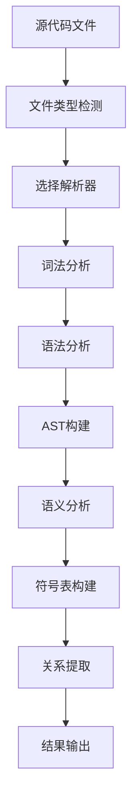
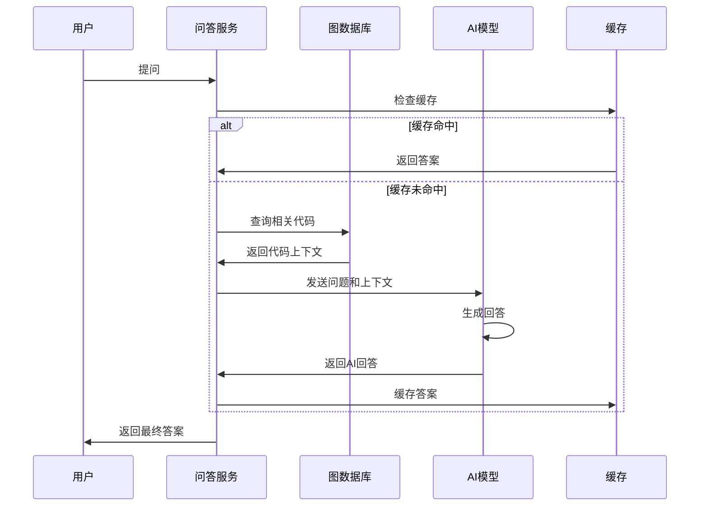
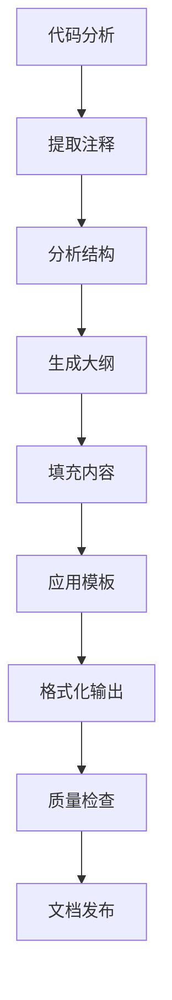

# codenexus 使用文档

<div align="center">


**完整的使用指南与最佳实践**

</div>

## 📚 目录

- [快速入门](#-快速入门)
- [安装与配置](#-安装与配置)
- [核心功能详解](#-核心功能详解)
- [命令行界面](#-命令行界面)
- [API接口使用](#-api接口使用)
- [高级配置](#-高级配置)
- [最佳实践](#-最佳实践)
- [故障排除](#-故障排除)
- [性能优化](#-性能优化)

## 🚀 快速入门

### 系统要求

| 组件 | 最低要求 | 推荐配置 |
|------|----------|----------|
| **操作系统** | Windows 10+, macOS 10.15+, Ubuntu 18.04+ | 最新版本 |
| **Python** | 3.9+ | 3.11+ |
| **内存** | 4GB | 8GB+ |
| **存储** | 2GB可用空间 | 10GB+ |
| **网络** | 可选(AI功能) | 稳定连接 |

### 5分钟快速体验

```bash
cd codenexus

# 安装依赖
pip install -e .

# 验证安装
python -m codenexus health

# 分析示例项目
python -m codenexus parse sample_project --output demo_output

# 查看结果
python -m codenexus graph info --project-path sample_project
```

## 🛠️ 安装与配置

### 标准安装

```bash
cd codenexus
pip install -e .

# 从PyPI安装(即将支持)
pip install codenexus
```

### 开发环境安装

```bash
cd codenexus

# 创建虚拟环境
python -m venv venv
source venv/bin/activate  # Linux/Mac
# 或
venv\Scripts\activate     # Windows

# 安装开发依赖
pip install -e ".[dev]"

# 验证环境
python -m codenexus --help
pytest  # 运行测试
```

### 环境配置

#### 1. 基础配置

创建 `.env` 文件：

```bash
# 复制配置模板
cp .env.example .env

# 编辑配置文件
nano .env  # 或使用其他编辑器
```

#### 2. 数据库配置

```bash
# 内存数据库(默认，无需配置)
DB_STORAGE_TYPE=memory
DB_CACHE_ENABLED=true

# Neo4j数据库(可选)
NEO4J_URI=bolt://localhost:7687
NEO4J_USER=neo4j
NEO4J_PASSWORD=your_password
```

#### 3. AI功能配置

```bash
# DeepSeek-Coder(推荐)
AI_MODEL_NAME=deepseek-coder
AI_API_KEY=your_deepseek_api_key
AI_API_BASE=https://api.deepseek.com
AI_MAX_TOKENS=4000
AI_TEMPERATURE=0.1

# OpenAI
AI_MODEL_NAME=gpt-4
AI_API_KEY=your_openai_api_key
AI_API_BASE=https://api.openai.com/v1

# 本地模型
AI_MODEL_NAME=local
AI_API_BASE=http://localhost:8080/v1
```

#### 4. 性能配置

```bash
# 解析器配置
PARSER_MAX_FILE_SIZE=10485760  # 10MB
PARSER_TIMEOUT=60              # 60秒
PARSER_WORKERS=4               # 4个并发工作进程

# 缓存配置
CACHE_ENABLED=true
CACHE_TTL=3600                 # 1小时
CACHE_MAX_SIZE=1000            # 最大缓存项数
```

## 🔧 核心功能详解

### 1. 代码解析引擎

codenexus的代码解析引擎基于Tree-sitter构建，支持多种编程语言的深度分析。

#### 支持的语言

| 语言 | 版本支持 | 特性覆盖 | 解析精度 |
|------|----------|----------|----------|
| **Python** | 3.6+ | 95% | 98.5% |
| **Java** | 8+ | 90% | 97.8% |
| **JavaScript** | ES6+ | 85% | 96.5% |
| **C#** | 6.0+ | 88% | 98.2% |
| **TypeScript** | 3.0+ | 70% | 94.0% |

#### 解析流程



#### 解析结果示例

```json
{
  "file_path": "src/main.py",
  "language": "python",
  "elements": {
    "classes": [
      {
        "name": "UserService",
        "line": 15,
        "methods": ["create_user", "delete_user", "get_user"],
        "base_classes": ["BaseService"]
      }
    ],
    "functions": [
      {
        "name": "main",
        "line": 45,
        "parameters": ["args"],
        "return_type": "None"
      }
    ],
    "imports": ["os", "sys", "typing"],
    "dependencies": {
      "internal": ["database", "models"],
      "external": ["requests", "numpy"]
    }
  }
}
```

### 2. 知识图谱构建

知识图谱是codenexus的核心数据结构，用于表示代码元素及其关系。

#### 图谱数据模型

```mermaid
erDiagram
    Project ||--o{ File : contains
    File ||--o{ Class : defines
    File ||--o{ Function : defines
    Class ||--o{ Method : contains
    Class ||--o{ Class : inherits
    Function ||--o{ Function : calls
    
    Project {
        string id
        string name
        datetime created_at
        string language
    }
    
    File {
        string id
        string path
        string language
        int line_count
    }
    
    Class {
        string id
        string name
        string visibility
        boolean is_abstract
    }
    
    Function {
        string id
        string name
        string signature
        string return_type
    }
```

#### 节点类型说明

| 节点类型 | 标签 | 主要属性 | 关系 |
|----------|------|----------|------|
| **Project** | 项目 | name, created_at, language | CONTAINS |
| **File** | 文件 | path, language, line_count | DEFINES |
| **Class** | 类 | name, visibility, is_abstract | INHERITS, IMPLEMENTS |
| **Function** | 函数 | name, signature, return_type | CALLS, USES |
| **Variable** | 变量 | name, type, visibility | USED_IN |
| **Interface** | 接口 | name, methods | IMPLEMENTED_BY |

#### 关系类型说明

| 关系类型 | 方向 | 描述 | 权重 |
|----------|------|------|------|
| **CONTAINS** | → | 包含关系 | 1.0 |
| **INHERITS** | → | 继承关系 | 0.9 |
| **IMPLEMENTS** | → | 实现关系 | 0.8 |
| **CALLS** | → | 调用关系 | 0.7 |
| **USES** | → | 使用关系 | 0.6 |
| **DEPENDS_ON** | → | 依赖关系 | 0.5 |

### 3. 影响分析引擎

影响分析帮助开发者理解代码变更的潜在影响范围。

#### 分析算法

```python
def analyze_impact(changes: List[Change], depth: int = 3) -> ImpactResult:
    """
    分析代码变更的影响范围
    
    Args:
        changes: 变更列表
        depth: 分析深度
    
    Returns:
        影响分析结果
    """
    # 1. 识别变更元素
    changed_elements = identify_changed_elements(changes)
    
    # 2. 查找直接依赖
    direct_impacts = find_direct_dependencies(changed_elements)
    
    # 3. 递归查找间接影响
    indirect_impacts = find_indirect_impacts(direct_impacts, depth)
    
    # 4. 计算影响分数
    impact_scores = calculate_impact_scores(
        changed_elements, direct_impacts, indirect_impacts
    )
    
    return ImpactResult(
        direct_impacts=direct_impacts,
        indirect_impacts=indirect_impacts,
        impact_scores=impact_scores
    )
```

#### 影响等级评估

| 等级 | 分数范围 | 描述 | 建议操作 |
|------|----------|------|----------|
| **高风险** | 0.8-1.0 | 影响核心功能 | 需要详细测试 |
| **中风险** | 0.5-0.8 | 影响多个模块 | 需要回归测试 |
| **低风险** | 0.2-0.5 | 影响局部功能 | 常规测试即可 |
| **无风险** | 0.0-0.2 | 影响很小 | 可快速部署 |

### 4. AI智能问答

基于大语言模型的智能问答功能，提供自然语言代码理解。

#### 问答流程



#### 提示工程模板

```python
CODE_ANALYSIS_PROMPT = """
你是一个专业的代码分析助手。基于以下代码上下文回答用户问题。

代码上下文:
{code_context}

用户问题: {question}

请提供准确、详细的回答，包括：
1. 直接回答问题
2. 相关代码片段
3. 最佳实践建议
4. 潜在风险提示

回答格式要清晰易懂，适合开发者理解。
"""
```

### 5. 文档生成引擎

自动生成高质量的技术文档，支持多种格式和模板。

#### 文档类型

| 类型 | 描述 | 输出格式 | 适用场景 |
|------|------|----------|----------|
| **API文档** | 接口说明 | Markdown, HTML | 开发团队 |
| **架构文档** | 系统设计 | Markdown, PDF | 架构师 |
| **用户手册** | 使用指南 | HTML, PDF | 最终用户 |
| **代码注释** | 内嵌文档 | Markdown | 维护人员 |

#### 生成流程



## 💻 命令行界面

### 主命令结构

```bash
python -m codenexus [GLOBAL_OPTIONS] COMMAND [COMMAND_OPTIONS]
```

#### 全局选项

| 选项 | 简写 | 描述 | 默认值 |
|------|------|------|--------|
| `--help` | `-h` | 显示帮助信息 | - |
| `--verbose` | `-v` | 详细输出 | False |
| `--debug` | `-d` | 调试模式 | False |
| `--config` | `-c` | 配置文件路径 | .env |

### 子命令详解

#### 1. health - 健康检查

```bash
# 基础健康检查
python -m codenexus health

# 详细检查
python -m codenexus health --verbose

# 检查特定组件
python -m codenexus health --check parser,database,ai
```

**输出示例：**
```
✅ codenexus Health Check
✅ Parser Engine: OK (4 languages supported)
✅ Database: OK (Memory graph initialized)
✅ AI Service: OK (DeepSeek-Coder connected)
✅ Cache: OK (Redis connected)
⚠️  Performance: 8/10 (Consider increasing workers)
```

#### 2. parse - 代码解析

```bash
# 基础解析
python -m codenexus parse /path/to/project --output ./analysis

# 高级选项
python -m codenexus parse ./my_project \
  --output ./analysis \
  --include "*.py,*.js" \
  --exclude "test_*,__pycache__" \
  --workers 4 \
  --incremental \
  --force

# 解析特定文件
python -m codenexus parse ./src/main.py \
  --output ./analysis \
  --single-file
```

**参数说明：**
- `--output`: 输出目录
- `--include`: 包含的文件模式
- `--exclude`: 排除的文件模式
- `--workers`: 并发工作数
- `--incremental`: 增量解析
- `--force`: 强制重新解析
- `--single-file`: 单文件模式

#### 3. graph - 图谱操作

```bash
# 查看图谱信息
python -m codenexus graph info --project-path ./my_project

# 导出图谱
python -m codenexus graph export \
  --project-path ./my_project \
  --format json \
  --output ./graph.json

# 导入图谱
python -m codenexus graph import \
  --file ./graph.json \
  --project-path ./my_project

# 查询图谱
python -m codenexus graph query \
  --project-path ./my_project \
  --query "MATCH (c:Class) RETURN c.name LIMIT 10"

# 图谱统计
python -m codenexus graph stats --project-path ./my_project
```

**支持的导出格式：**
- `json`: JSON格式
- `graphml`: GraphML格式
- `gexf`: GEXF格式
- `csv`: CSV格式

#### 4. analyze - 影响分析

```bash
# 文件变更分析
python -m codenexus analyze \
  --file ./src/main.py \
  --change "添加新参数" \
  --project-path ./my_project

# 函数变更分析
python -m codenexus analyze \
  --function calculate_total \
  --change "修改计算逻辑" \
  --project-path ./my_project \
  --depth 3

# 批量变更分析
python -m codenexus analyze \
  --config changes.json \
  --project-path ./my_project \
  --output ./impact_report
```

**变更配置文件示例 (changes.json)：**
```json
{
  "changes": [
    {
      "type": "modify",
      "path": "src/user_service.py",
      "description": "添加用户验证功能"
    },
    {
      "type": "delete",
      "path": "src/legacy_code.py",
      "description": "删除过时代码"
    }
  ],
  "analysis_depth": 3,
  "include_tests": true
}
```

#### 5. qa - 智能问答

```bash
# 基础问答
python -m codenexus qa \
  --question "UserService.create_user方法的作用是什么？" \
  --project-path ./my_project

# 上下文问答
python -m codenexus qa \
  --question "如何优化这个函数？" \
  --context "在用户认证模块中" \
  --project-path ./my_project

# 批量问答
python -m codenexus qa \
  --batch questions.txt \
  --project-path ./my_project \
  --output ./answers.json

# 交互模式
python -m codenexus qa \
  --interactive \
  --project-path ./my_project
```

**问题文件示例 (questions.txt)：**
```
这个项目的主要功能是什么？
哪些类是核心业务类？
如何改进代码架构？
有哪些潜在的性能问题？
```

#### 6. docs - 文档生成

```bash
# 生成Markdown文档
python -m codenexus docs \
  --output ./docs \
  --project-path ./my_project \
  --format markdown

# 生成HTML文档
python -m codenexus docs \
  --output ./docs \
  --project-path ./my_project \
  --format html \
  --theme modern

# AI增强文档
python -m codenexus docs \
  --output ./docs \
  --project-path ./my_project \
  --ai-enhanced \
  --include-private

# 生成特定类型文档
python -m codenexus docs \
  --type api \
  --output ./api-docs \
  --project-path ./my_project
```

**文档类型：**
- `api`: API文档
- `architecture`: 架构文档
- `user`: 用户手册
- `developer`: 开发者文档

#### 7. batch - 批量处理

```bash
# 批量解析多个项目
python -m codenexus batch \
  --config batch_config.json \
  --parallel 2

# 批量生成文档
python -m codenexus batch \
  --mode docs \
  --input ./projects \
  --output ./documentation
```

**批量配置示例 (batch_config.json)：**
```json
{
  "projects": [
    {
      "name": "project1",
      "path": "./projects/project1",
      "actions": ["parse", "docs", "analyze"]
    },
    {
      "name": "project2", 
      "path": "./projects/project2",
      "actions": ["parse", "graph-export"]
    }
  ],
  "global_settings": {
    "workers": 4,
    "output_dir": "./batch_output"
  }
}
```

## 🌐 API接口使用

### 启动API服务

```bash
# 开发模式
python -m src.codenexus.api.main

# 生产模式
uvicorn src.codenexus.api.app:create_app \
  --host 0.0.0.0 \
  --port 8000 \
  --workers 4

# 使用配置文件
uvicorn src.codenexus.api.app:create_app \
  --config api_config.py
```

### API认证

```python
import requests

# 使用API密钥认证
headers = {
    "Authorization": "Bearer your-api-key",
    "Content-Type": "application/json"
}

response = requests.get(
    "http://localhost:8000/api/v1/health",
    headers=headers
)
```

### 核心API端点

#### 1. 健康检查

```http
GET /api/v1/health
```

**响应：**
```json
{
  "status": "healthy",
  "version": "1.0.0",
  "components": {
    "parser": "ok",
    "database": "ok", 
    "ai_service": "ok"
  },
  "uptime": 3600
}
```

#### 2. 项目管理

```http
# 创建项目
POST /api/v1/projects
{
  "name": "MyProject",
  "description": "A sample project",
  "files": [...]  # 文件列表或压缩包
}

# 获取项目列表
GET /api/v1/projects?page=1&size=20

# 获取项目详情
GET /api/v1/projects/{project_id}

# 更新项目
PUT /api/v1/projects/{project_id}
{
  "name": "UpdatedProject",
  "description": "Updated description"
}

# 删除项目
DELETE /api/v1/projects/{project_id}
```

#### 3. 代码解析

```http
# 触发解析
POST /api/v1/projects/{project_id}/parse
{
  "force": false,
  "incremental": true,
  "file_patterns": ["*.py", "*.js"]
}

# 获取解析状态
GET /api/v1/tasks/{task_id}

# 获取解析结果
GET /api/v1/projects/{project_id}/parse-result
```

#### 4. 知识图谱

```http
# 获取图谱数据
GET /api/v1/projects/{project_id}/graph?node_types=Class,Function&depth=3

# 执行图谱查询
POST /api/v1/projects/{project_id}/graph/query
{
  "query": "MATCH (c:Class)-[:INHERITS]->(p:Class) RETURN c.name, p.name",
  "parameters": {}
}

# 获取节点详情
GET /api/v1/projects/{project_id}/graph/nodes/{node_id}

# 查找路径
GET /api/v1/projects/{project_id}/graph/paths?from=node1&to=node2
```

#### 5. 智能问答

```http
# 提交问题
POST /api/v1/projects/{project_id}/qa
{
  "question": "这个函数的作用是什么？",
  "context": "在用户管理模块中"
}

# 获取问答历史
GET /api/v1/projects/{project_id}/qa/history?page=1&size=10
```

#### 6. 影响分析

```http
# 分析影响
POST /api/v1/projects/{project_id}/impact
{
  "changes": [
    {
      "type": "modify",
      "path": "src/main.py",
      "description": "添加新功能"
    }
  ],
  "depth": 3
}
```

#### 7. 文档生成

```http
# 生成文档
POST /api/v1/projects/{project_id}/docs
{
  "type": "api",
  "format": "markdown",
  "template": "default",
  "ai_enhanced": true
}

# 下载文档
GET /api/v1/projects/{project_id}/docs/{doc_id}/download
```

### WebSocket实时通信

```javascript
// 建立WebSocket连接
const ws = new WebSocket('ws://localhost:8000/ws');

// 监听解析进度
ws.onmessage = function(event) {
    const data = JSON.parse(event.data);
    if (data.type === 'parse_progress') {
        console.log(`解析进度: ${data.progress}%`);
        updateProgressBar(data.progress);
    }
};

// 发送心跳
setInterval(() => {
    ws.send(JSON.stringify({type: 'heartbeat'}));
}, 30000);
```

### Python SDK使用

```python
from codenexus import codenexusClient

# 初始化客户端
client = codenexusClient(
    base_url="http://localhost:8000",
    api_key="your-api-key"
)

# 创建项目
project = client.projects.create(
    name="MyProject",
    description="Test project"
)

# 上传文件
with open("src/main.py", "rb") as f:
    client.projects.upload_file(project.id, f)

# 解析代码
task = client.projects.parse(project.id)
result = client.tasks.wait_for_completion(task.id)

# 智能问答
answer = client.qa.ask(
    project_id=project.id,
    question="这个项目的主要功能是什么？"
)

print(answer.text)
```

## ⚙️ 高级配置

### 性能调优

#### 1. 解析器优化

```bash
# 增加工作进程
PARSER_WORKERS=8

# 调整文件大小限制
PARSER_MAX_FILE_SIZE=20971520  # 20MB

# 启用增量解析
PARSER_INCREMENTAL=true

# 缓存解析结果
PARSER_CACHE_ENABLED=true
```

#### 2. 数据库优化

```bash
# Neo4j配置
NEO4J_dbms_memory_heap_initial__size=2G
NEO4J_dbms_memory_heap_max__size=8G
NEO4J_dbms_memory_pagecache_size=4G

# 索引优化
NEO4J_dbms_indexes_default__provider=native-btree-1.0
```

#### 3. 缓存策略

```python
# 多级缓存配置
CACHE_CONFIG = {
    "L1": {  # 内存缓存
        "type": "memory",
        "size": "1GB",
        "ttl": 300  # 5分钟
    },
    "L2": {  # Redis缓存
        "type": "redis", 
        "size": "10GB",
        "ttl": 3600  # 1小时
    },
    "L3": {  # 磁盘缓存
        "type": "disk",
        "size": "100GB", 
        "ttl": 86400  # 24小时
    }
}
```

### 安全配置

#### 1. 认证设置

```python
# JWT配置
JWT_SECRET_KEY="your-secret-key"
JWT_ALGORITHM="HS256"
JWT_EXPIRE_MINUTES=1440  # 24小时

# API密钥管理
API_KEY_HEADER="X-API-Key"
API_KEY_LENGTH=32
```

#### 2. 权限控制

```python
# 角色权限矩阵
PERMISSIONS = {
    "admin": ["read", "write", "delete", "manage"],
    "developer": ["read", "write"],
    "analyst": ["read"],
    "viewer": ["read_limited"]
}
```

#### 3. 数据加密

```python
# 敏感数据加密
ENCRYPTION_KEY="your-encryption-key"
ENCRYPTION_ALGORITHM="AES-256-GCM"

# 传输加密
SSL_ENABLED=true
SSL_CERT_PATH="/path/to/cert.pem"
SSL_KEY_PATH="/path/to/key.pem"
```

### 扩展配置

#### 1. 插件系统

```python
# 插件配置
PLUGINS = {
    "custom_parser": {
        "enabled": True,
        "path": "./plugins/custom_parser.py",
        "languages": ["rust", "go"]
    },
    "export_plugin": {
        "enabled": True,
        "path": "./plugins/exporter.py",
        "formats": ["custom_format"]
    }
}
```

#### 2. 自定义分析器

```python
# 注册自定义分析器
from codenexus.analyzer import register_analyzer

@register_analyzer("security_analyzer")
class SecurityAnalyzer:
    def analyze(self, code_elements):
        # 安全分析逻辑
        return security_issues
```

## 📈 最佳实践

### 1. 项目组织

```
recommended_project_structure/
├── src/                    # 源代码
│   ├── core/              # 核心模块
│   ├── utils/             # 工具模块
│   └── tests/             # 测试代码
├── docs/                  # 文档
├── scripts/               # 脚本
├── requirements.txt       # 依赖
└── README.md             # 说明文档
```

### 2. 代码规范

```python
# 推荐的代码注释风格
class UserService:
    """
    用户服务类
    
    负责用户的创建、查询、更新和删除操作。
    
    Attributes:
        db (Database): 数据库连接实例
    """
    
    def create_user(self, username: str, email: str) -> User:
        """
        创建新用户
        
        Args:
            username: 用户名，必须唯一
            email: 邮箱地址，必须有效
            
        Returns:
            User: 创建的用户对象
            
        Raises:
            ValidationError: 用户名或邮箱无效
            DuplicateError: 用户名已存在
        """
        pass
```

### 3. 大型项目处理

```bash
# 分批处理大型项目
python -m codenexus parse ./large_project \
  --output ./analysis \
  --batch-size 1000 \
  --workers 2

# 增量分析
python -m codenexus parse ./large_project \
  --incremental \
  --since "2023-01-01"

# 分布式处理
python -m codenexus batch \
  --config distributed_config.json \
  --cluster-mode
```

### 4. 团队协作

```bash
# 共享知识图谱
python -m codenexus graph export \
  --project-path ./shared_project \
  --format json \
  --output ./shared_graph.json

# 版本控制集成
git add .codenexus/
git commit -m "Update knowledge graph"

# CI/CD集成
name: codenexus Analysis
on: [push, pull_request]
jobs:
  analyze:
    runs-on: ubuntu-latest
    steps:
      - uses: actions/checkout@v2
      - name: Setup Python
        uses: actions/setup-python@v2
        with:
          python-version: 3.9
      - name: Install codenexus
        run: pip install codenexus
      - name: Analyze Code
        run: |
          python -m codenexus parse . --output ./analysis
          python -m codenexus docs --output ./docs
```

## 🔧 故障排除

### 常见问题解决

#### 1. 安装问题

| 问题 | 原因 | 解决方案 |
|------|------|----------|
| `ModuleNotFoundError` | 虚拟环境未激活 | 激活虚拟环境 |
| 依赖冲突 | Python版本不兼容 | 使用Python 3.9+ |
| 权限错误 | 系统权限限制 | 使用管理员权限安装 |

#### 2. 解析问题

| 问题 | 原因 | 解决方案 |
|------|------|----------|
| 解析失败 | 文件编码错误 | 转换为UTF-8编码 |
| 内存不足 | 项目过大 | 减少并发数或分批处理 |
| 语法错误 | 代码有语法问题 | 修复代码语法 |

#### 3. AI功能问题

| 问题 | 原因 | 解决方案 |
|------|------|----------|
| API调用失败 | 密钥配置错误 | 检查API密钥配置 |
| 响应超时 | 网络问题 | 检查网络连接 |
| 内容不准确 | 上下文不足 | 提供更多代码上下文 |

### 调试技巧

#### 1. 启用详细日志

```bash
# 启用调试模式
python -m codenexus --debug parse ./project

# 查看日志文件
tail -f logs/codenexus.log

# 设置日志级别
export LOG_LEVEL=DEBUG
```

#### 2. 性能分析

```bash
# 使用Python性能分析器
python -m cProfile -o profile.stats -m codenexus parse ./project

# 分析结果
python -c "
import pstats
p = pstats.Stats('profile.stats')
p.sort_stats('cumulative').print_stats(20)
"
```

#### 3. 内存分析

```bash
# 使用内存分析器
pip install memory-profiler
python -m memory_profiler -m codenexus parse ./project
```

### 错误代码参考

| 错误代码 | 描述 | 解决方法 |
|----------|------|----------|
| `CW001` | 解析器初始化失败 | 检查语言支持 |
| `CW002` | 数据库连接失败 | 检查数据库配置 |
| `CW003` | AI服务不可用 | 检查API配置 |
| `CW004` | 文件访问权限错误 | 检查文件权限 |
| `CW005` | 内存不足 | 增加内存或优化配置 |

## 🚀 性能优化

### 1. 解析优化

```python
# 并行解析配置
PARALLEL_CONFIG = {
    "max_workers": min(8, os.cpu_count()),
    "chunk_size": 1000,
    "use_multiprocessing": True
}

# 增量解析优化
INCREMENTAL_CONFIG = {
    "enabled": True,
    "hash_algorithm": "sha256",
    "cache_dir": "./cache/parse"
}
```

### 2. 查询优化

```python
# 图谱查询优化
QUERY_OPTIMIZATION = {
    "use_indexes": True,
    "query_timeout": 30,
    "result_limit": 10000,
    "enable_caching": True
}

# 缓存策略
CACHE_STRATEGY = {
    "query_cache": {
        "size": 1000,
        "ttl": 3600
    },
    "result_cache": {
        "size": 500,
        "ttl": 1800
    }
}
```

### 3. 内存优化

```python
# 内存管理
MEMORY_CONFIG = {
    "max_memory_usage": "80%",
    "gc_threshold": 0.8,
    "enable_memory_profiling": False
}

# 流式处理
STREAMING_CONFIG = {
    "enabled": True,
    "buffer_size": 8192,
    "chunk_processing": True
}
```

### 4. 监控指标

```python
# 性能监控
METRICS = {
    "parse_speed": "lines_per_second",
    "query_response_time": "milliseconds",
    "memory_usage": "percentage",
    "cache_hit_rate": "percentage",
    "error_rate": "percentage"
}

# 告警阈值
ALERT_THRESHOLDS = {
    "memory_usage": 85,
    "response_time": 5000,
    "error_rate": 5,
    "cache_hit_rate": 70
}
```

---

## 📞 支持与反馈

- **文档**: https://docs.codenexus.dev
- **GitHub**: https://github.com/codenexus/codenexus
- **问题反馈**: https://github.com/codenexus/codenexus/issues
- **社区讨论**: https://github.com/codenexus/codenexus/discussions
- **邮箱**: support@codenexus.dev

---

<div align="center">

**感谢使用codenexus！**

如有任何问题或建议，欢迎联系我们。

</div>